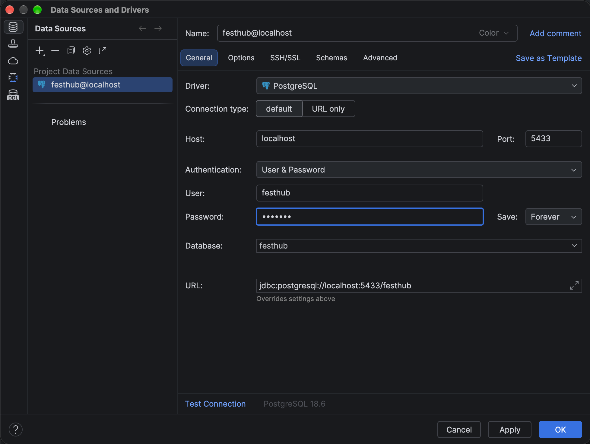

# FestHub

1. install [docker desktop](https://www.docker.com/products/docker-desktop/) and open it
2. start the database
   ```bash
   docker compose up -d --build --wait
   ```
3. install the python packages (first time only, needs python 3.10 or newer)
   ```bash
   python3 -m venv .venv
   .venv/bin/pip install -r requirements.txt
   ```
4. start the shell
   ```bash
   PYTHONPATH=logic .venv/bin/python web/cli.py shell
   ```
5. type `exit` to leave the shell, then stop the database
   ```bash
   docker compose down
   ```

the database starts with the demo's events, artists, categories, and media from `db/seed.sql`. your data is kept between runs. to start over with just the demo data, use `docker compose down -v` instead. do this once whenever `db/schema.sql` or `db/seed.sql` changes too.

on windows, use `.venv\Scripts\` instead of `.venv/bin/`, and in powershell run `$env:PYTHONPATH="logic"` first instead of putting `PYTHONPATH=logic` in front.

if you want to access the postgres database  in your ide, use this config: 
